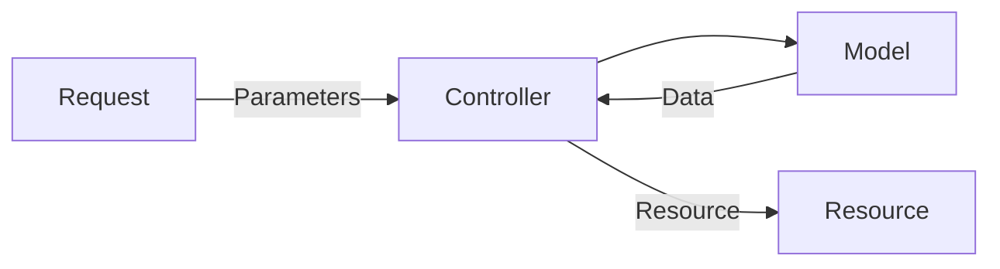

# Coding Test

Thank you for applying to us. We have created this exercise in order to gain insights into your development skills.

## Requirements

- [Docker](https://docs.docker.com/desktop/)
- [Composer](https://getcomposer.org/)

## Get started

### Setup

```
$ cp .env.example .env
$ composer install
```

### Executing

Here is the case with Laravel sail. It depends on you.

```
$ ./vendor/bin/sail up
$ ./vendor/bin/sail artisan key:generate
$ ./vendor/bin/sail artisan migrate:fresh --seed
```

### Testing

Here is the case with Laravel sail. It depends on you.

```
$ ./vendor/bin/sail artisan test
```

## Architecture



# Requirement Specifications

This repository provides an API for admins to create and publish job data.

## APIs

- Public
  - `GET /api/jobs`: Get a list of opening jobs
  - `GET /api/jobs/{id}`: Retrieve a opening job by its id
- Admin
  - `POST /api/admin/login`: Log in
  - `POST /api/admin/logout`: Log out
  - `GET /api/admin/me`: Get currently logged in user data
  - `GET /api/admin/jobs`: Get a list of jobs
  - `GET /api/admin/jobs/{id}`: Retrieve a job by its id
  - `POST /api/admin/jobs`: Create a job
  - `PUT /api/admin/jobs/{id}`: Update the job
  - `DELETE /api/admin/jobs/{id}`: Delete the job

## APIs in the future

Our clients want companies to register their jobs as well. So, we need to provide some APIs:

:warning: **You don't need to implement these apis, but refactor current code for the future.** :warning:

- Company
  - `POST /api/company/login`: Log in
  - `POST /api/company/logout`: Log out
  - `GET /api/company/me`: Get currently logged in user data
  - `GET /api/company/jobs`: Get a list of their jobs
  - `GET /api/company/jobs/{id}`: Retrieve a their job by its id
  - `POST /api/company/jobs`: Create a job
  - `PUT /api/company/jobs/{id}`: Update a job
  - `DELETE /api/company/jobs/{id}`: Delete a job
